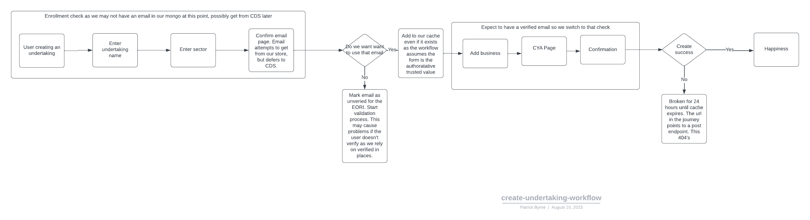
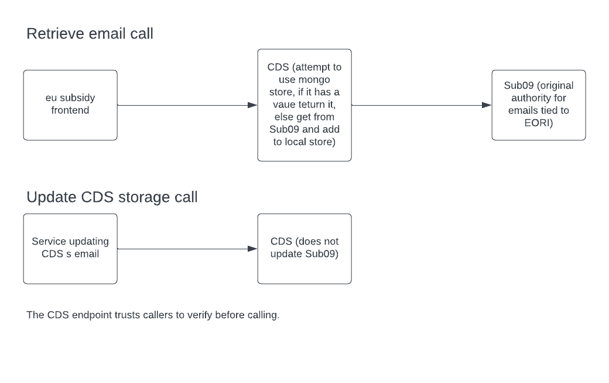
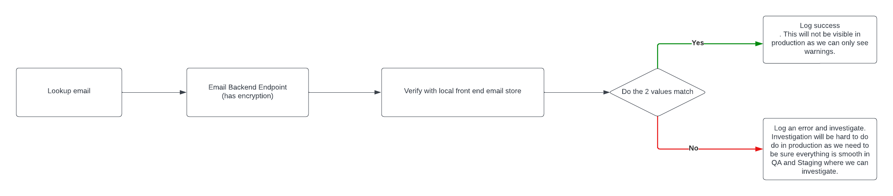
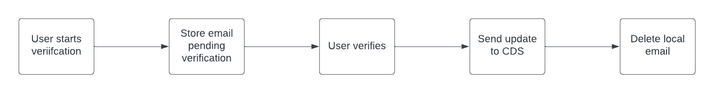
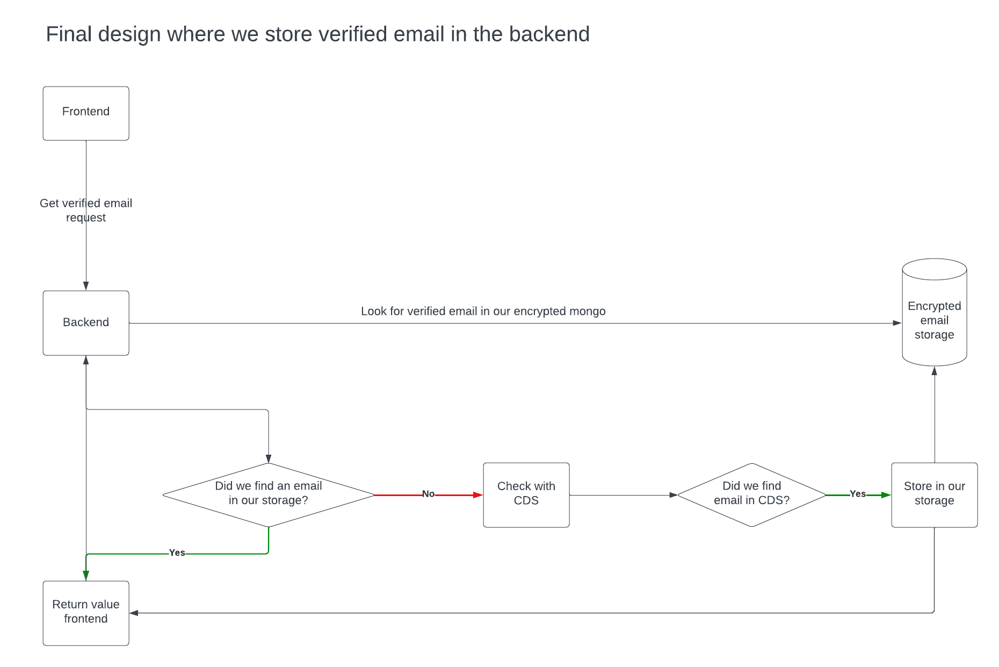

# Current MongoDB email storage design

We use mongodb for things like journey state. We are referring to the email mongodb as a cache, but it is not really 
a cache as it can become divergent by design.

If we do switch to just using CDS we will possibly have to sync our current changed emails with them, this may 
impact other services as they have possibly set a custom value differing to our value. Something to think about.

## Where do we initially get the emails from in an undertaking?

Our mongodb is likely missing the email address. In that case, we defer to CDS to get the email in the "create undertaking" journey.
We assume the email has been verified in the CDS storage. Though that storage could have an unverified email set as the update email
storage endpoint on their service could be used by another service without going through a verification process.

We always add the email to our MongoDb email store whether it exists or not so self repairs.

## CDS workflow
Once the CDS storage is updated, it diverges, hence it is not a cache.

CDS defers to Sub09 for initial storage population, but after that the data stored potentially branches off from updates from services.

## Sending email 

If we do not have it in our stroage, we defer to CDS. We do not add that value to our storage.

## Do we need to store the email in our storage?

Unfortunately, if we want to guarantee the email to be verified, then yes. We are assuming that CDS/Sub09 has emails that have been
verified but this may not be the case. The CDS update storage process does not update its original authoritative source, the
update endpoint also may be used by services that have not done verification (trust issues?).

In an ideal world, an EORI would have one email assigned to it, and we could just refer to that source. A verification
process would manage and guard that storage. Currently, each application may have its own email value set per EORI.

## How long do we want to keep the entry in MongoDB?

In the current design, if we lose the stored value, everything breaks as has been demonstrated last week.
We only populate the storage in the "create undertaking" journey. On many journeys, we check for the existence 
of a verified email in our MongoDB email storage. If we do not have a storage entry, we currently blow up with no way to
rectify. We are changing the design to fire off the email verification process in those cases, so losing the storage entry
will no longer be catastrophic.

### With the improved self-rectifying verified email process, what would the issue/s be if we lost the storage entry? 

The main issue is user experience. The user would have to redo the verification. This comes down to the lack of authoritative  
source for a verified email tied to an EORI we can self repair from. Can we design a user experience where we only keep
it say yearly if we have the reverification mechanism?

## How consistent are we in checking the storage before checking CDS

We always check our MongoDB email storage. As our storage diverges from CDS it is not a storage. As mentioned, CDS can also
diverge.

## PII concerns? Do we need GDRP?

There are issues with the zone we are keeping the data in (it is in the frontend), and also it is not encrypted. Gerald Benischke
recommends we move it to the backend and encrypt it. 

## question for CDS - if we get a response from CDS - is it verified? can we raise this with CDS please

We could raise it, but as their endpoint is not forcefully tied to verification and relies on the consumers to verify before 
 updating, it becomes an issue of faith. Did Sub09 verify its value where CDS got its value from? Is this good enough for us?

## If we encrypt the emails - impact to the performance?

Not noticeably, we would have to be under very high load to notice adding such low level of cpu overhead. 

## What and whose support is needed for encryption?

Encryption is done by the JSON serializer/deserializer which we use to create and read the stored entry. The data migration
task is where the fun will happen. 

##  Are we going to test the encryption in QA before Prod? How?

Of course, and Staging. We can get a copy of the mongodb for QA and Staging but not live. We need to get the dry run perfect
before doing the process in live. We can also keep both stores for a while and use the non encrypted to sanity check the encrypted.
After we have X period of no issues, we can remove the non-encrypted logic. We cannot debug production, so we want to guarantee
smoothness before turning off.

## can we add logs to the code to highlight how often we use our storage?

We should probably refrain from using the term cache as it indicates there
is an authoritative source we can rely on. As mentioned, we cannot see logs that are not warnings/errors in production.
We can log warnings where we do not hit our storage. Though in some cases, this is expected.

### Storage is missed when creating an undertaking 
This is expected on a first journey. The journey populates our storage. We also confirm with the user if that value is 
correct, so they can set another which fires off the verification process. The email in CDS being verified has some 
assumption tied to it.

### Storage is missed when sending an Email

All email addresses are retrieved by EORI. We give the option to email using a manually entered EORIs such as when 
removing a business entity. We send to the EORI from the login session as well. We may get storage misses from the 
manually entered EORI as they may not have created an undertaking via our service, but we should not get storage misses from 
the primary session-based EORI. 

## CDS response for unverified email?
The CDS system has no real concept of verified, the CDS storage does not have that flag. We are assuming its value is 
verified. If they do not have it, they defer to Sub09 to fill their storage. If it is not attainable, we fail in 
the undertaking journey.

## What would the design using CDS only look like

CDS does not have a pending verified state.

* We would still have to have a mongo db, we would need to keep track of the email prior to the user verifying. 
* We would update CDS and delete our entry after the user verifies. 

A more ideal CDS design would cater for this and also allow application namespacing for email addresses if we desired.

## What could the design look like with email encrypted in the backend with an interim recovery mechanism?

We are going to have to do data migration within the app. The JSON encoders within the application handle the encoding,
so we will need to transfer data across from the frontend to the backend. In production, there is a level of blindness
and second chances do not come easily (probably massive understatement).

This is a variation of the strangler application pattern, priority is given to the backend storage, if it is not found
there we defer to the frontend storage, if it is found there we log a warning as we had a migration issue and transfer 
it to the backend. 

We could move the CDS calls at this point, but we need to be careful as CDS may have an out-of-date email for the EORI
as our system diverges from CDS.

## Final design with all verified email logic in the backend
We have detached from our frontend Mongo, all CDS logic is in the backend.

## Migrating data to the backend

We can batch as mentioned in the diagram. If we decide to have an interim stage where we keep the old store and can repair
on the fly we start treating the backend mongo as primary, so we no longer update via the migration tooling.

